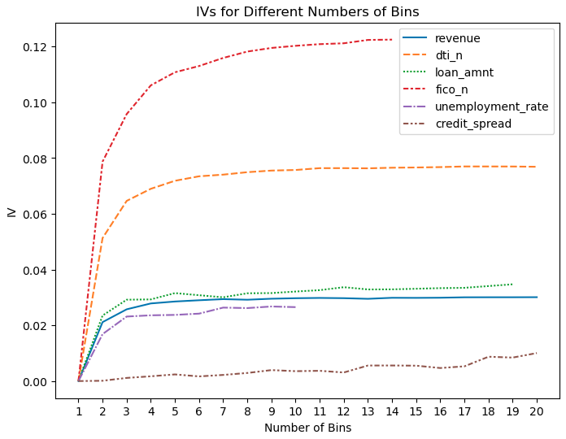
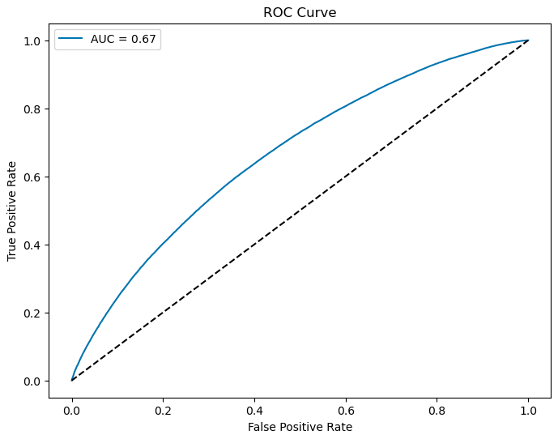
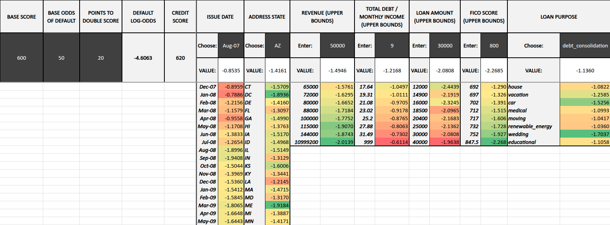

# Credit Scorecard Model

An end-to-end credit scorecard built from the Lending Club US retail-loan dataset, using
weight-of-evidence variable selection and logistic regression in Python, and delivered as an
interactive Excel scorecard. The project covers the full workflow a credit risk analyst would
follow: data preparation, variable selection, model fitting and validation, and conversion of the
fitted model into a points-based scorecard that a non-technical user can operate.

## Overview

The goal is to predict the probability that a borrower defaults, using only information available at
the point of loan application, and to express that prediction as a transparent scorecard.

The pipeline:

1. **Data preparation** — an 80/20 train/test split (`random_state=42`) of the Lending Club dataset.
2. **Variable selection** — weight-of-evidence (WoE) and information value (IV) are used to rank
   predictors. IV is computed for the continuous variables across a range of bin counts to find
   where it plateaus, and once for each categorical variable.
3. **WoE encoding** — every predictor value is replaced by the WoE of its bin or category. Bin
   boundaries and WoE values are learned on the training set and applied to the test set to avoid
   leakage.
4. **Modelling** — two logistic regression models are fitted with class balancing: an unpenalised
   model and a heavily penalised ridge model (`C = 0.0001`). The Kolmogorov–Smirnov statistic is
   used to choose the classification threshold.
5. **Validation** — ROC/AUC, confusion matrices, and precision, accuracy, recall and F1 scores on
   the held-out test set, plus variance inflation factors (VIF) to check for multicollinearity.
6. **Scorecard conversion** — the unpenalised model's coefficients and bin WoEs are turned into
   per-bin points and assembled into an interactive Excel workbook.

WoE and IV are defined as:

```
WoE = ln(%good / %bad)     per bin
IV  = Σ (%good − %bad) × WoE   summed over bins
```

## Repository structure

```
.
├── Code/
│   ├── credit_scorecard.ipynb        # Notebook (primary, run top to bottom)
│   └── credit_scorecard.py           # Script export of the same pipeline
├── Datasets/
│   ├── LC_loans.csv                  # Source data — download from Zenodo (see Data)
│   ├── X_train.csv / X_test.csv      # Raw feature splits (regenerated by the notebook)
│   ├── X_train_woes.csv / ...        # WoE-encoded splits (regenerated by the notebook)
│   ├── y_train.csv / y_test.csv      # Targets (regenerated by the notebook)
│   ├── scorecard_bin_labels.csv      # Bin edges / categories feeding the Excel scorecard
│   └── scorecard_bin_scores.csv      # Per-bin points feeding the Excel scorecard
├── Scorecard/
│   └── credit_scorecard_unpenalised.xlsx   # Interactive points-based scorecard
├── Images/                           # Figures produced by the pipeline
├── Analysis/
│   ├── credit_scorecard_analysis.pdf # Full written analysis and discussion
│   └── credit_scorecard_analysis.docx
├── requirements.txt
└── README.md
```

## Method in more detail

**Variables.** The model uses application-time fields only: issue date, income (`revenue`),
debt-to-income (`dti_n`), loan amount, FICO score, loan purpose, home ownership, employment length,
prior-borrower flag (`experience_c`) and state. The free-text `title` field was dropped after its IV
came out very low; `id`, `zip_code` and `desc` were excluded up front as non-predictive, too granular
or too sparse.



Fourteen equal-percentile bins were chosen for the continuous variables — the largest number that
keeps every FICO bin populated (avoiding infinite WoE), beyond which IV gains are marginal.

**Class imbalance.** Defaults are the minority class, so both models are fitted with
`class_weight='balanced'`. The KS-optimal threshold maximises the gap between the true-positive and
false-positive rates, which favours recall — appropriate here, since failing to flag a defaulter is
more costly than a false alarm.

**Ridge model.** A heavily penalised ridge model was fitted to test whether reducing effective model
complexity improves out-of-sample performance. It does not: scores fall slightly and no variable is
driven out, indicating that all retained variables carry predictive weight.

## Results

Evaluated on the held-out test set at the KS-optimal threshold, both models with class balancing:

| Model                   | AUC  | Precision | Recall | Accuracy | F1   |
|-------------------------|------|-----------|--------|----------|------|
| Unpenalised logistic    | 0.67 | 0.29      | 0.62   | 0.62     | 0.39 |
| Ridge logistic (C=1e-4) | 0.66 | 0.29      | 0.61   | 0.62     | 0.39 |



Accuracy and recall beat chance, while precision is low — the recall-oriented threshold accepts more
false positives by design. Removing the class overweighting nudges precision up and recall down, with
little net change in F1. VIFs are all close to 1, so multicollinearity is not a concern. See
`Analysis/credit_scorecard_analysis.pdf` for the full discussion.

## The interactive scorecard

`Scorecard/credit_scorecard_unpenalised.xlsx` converts the unpenalised model into a points-based
scorecard. The user can set a base score and the points-to-double-the-odds (20 is a common choice),
choose categorical values from dropdowns, and enter continuous values within the training range. The
total score updates live, and conditional formatting highlights which inputs push default risk up or
down.



## Data

The dataset is the **Lending Club loan dataset for granting models** (Ariza-Garzón, Sanz-Guerrero and
Arroyo Gallardo, 2024), a cleaned granting-model version of the public Lending Club loans, available
from Zenodo: https://doi.org/10.5281/zenodo.11295916 (CC BY 4.0).

Two files exceed GitHub's 100 MB per-file limit and so are **not committed** to the repository:
`Datasets/LC_loans.csv` (~167 MB) and `Datasets/X_train_woes.csv` (~199 MB). The other split files are
also large. All of them are reproducible, so the recommended setup is:

1. Download `LC_loans.csv` from the Zenodo record above and place it in `Datasets/`.
2. Run the notebook — it regenerates the `X_*` / `y_*` split files as a checkpoint.

A `.gitignore` is included that excludes the source file and the regenerated splits. If you would
rather version the large files directly, use [Git LFS](https://git-lfs.com/) instead.

## Getting started

Requires Python 3.9+ and the packages in `requirements.txt` (scikit-learn 1.2+ is needed for the
`penalty=None` option).

```bash
git clone <https://github.com/curingd/credit-scorecard-model>
cd <repo>
pip install -r requirements.txt
# place LC_loans.csv in Datasets/ (see Data above)
jupyter lab Code/credit_scorecard.ipynb   # run top to bottom
```

Running the notebook end to end regenerates the data splits, fits both models, writes the figures in
`Images/`, and produces the scorecard bin CSVs that feed the Excel workbook. The train/test split is
seeded (`random_state=42`) for reproducibility.

## References

Ariza-Garzón, M.J., Sanz-Guerrero, M. and Arroyo Gallardo, J. (2024) *Lending Club loan dataset for
granting models* (Version 0.1) [Dataset]. Universidad Complutense de Madrid. Available at:
https://doi.org/10.5281/zenodo.11295916 (Accessed: 10 July 2026).

Howgate, K. (2021) *How to build a credit scorecard*. STOR-i, Lancaster University. Available at:
https://www.lancaster.ac.uk/stor-i-student-sites/katie-howgate/2021/02/07/how-to-build-a-credit-scorecard/
(Accessed: 10 July 2026).

Siddiqi, N. (2006) *Credit Risk Scorecards: Developing and Implementing Intelligent Credit Scoring*.
Hoboken, NJ: John Wiley & Sons.

## Author

David Curington
